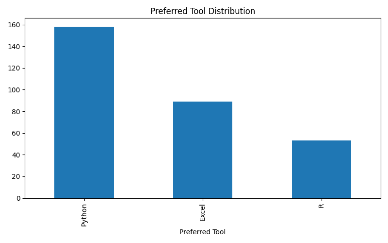
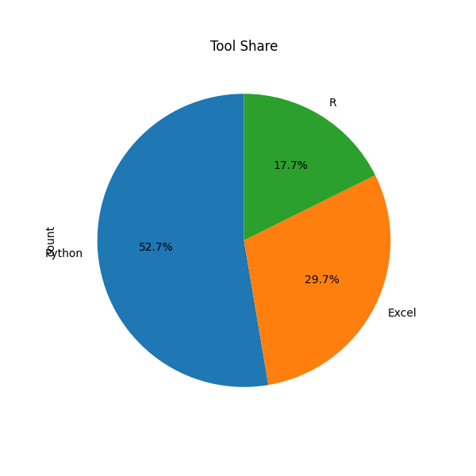

# 📊 Poll Results Visualizer

## 🚀 Overview

Poll Results Visualizer is an end-to-end Data Science project that analyzes survey/poll data and transforms it into meaningful insights using interactive visualizations and a modern Streamlit dashboard.

This project demonstrates the complete data pipeline — from data generation to analysis and dashboard deployment.

---

## ❗ Problem Statement

Raw survey data is often difficult to interpret and time-consuming to analyze manually. Organizations need a faster and more intuitive way to extract insights from poll results.

---

## ✅ Solution

This project processes poll data and provides:

* Automated analysis
* Interactive visualizations
* Real-time filtering
* Insightful dashboards for decision-making

---

## ✨ Key Features

* 📥 Synthetic Poll Data Generation
* 🧹 Data Cleaning & Preprocessing
* 📊 Vote Count & Percentage Analysis
* 📈 Bar Chart & Pie Chart Visualization
* 👨‍👩‍👧 Demographic Analysis (Gender-based)
* ⭐ Satisfaction Distribution Analysis
* ☁️ Word Cloud for Feedback Insights
* 🎯 Interactive Streamlit Dashboard with Filters
* 🎨 Premium UI Dashboard Design

---

## 🛠 Tech Stack

* **Python**
* **Pandas & NumPy**
* **Matplotlib & Seaborn**
* **Streamlit**
* **WordCloud**

---

## 📊 Dashboard Highlights

* KPI Cards (Total Responses, Avg Satisfaction, Top Tool)
* Tool Distribution (Bar + Pie)
* Gender-based Analysis
* Satisfaction Trends
* Feedback Word Cloud

---

## 📁 Project Structure

```
Poll-Results-Visualizer/
│
├── app.py
├── analysis.py
├── visualization.py
├── data_generator.py
├── poll_data.csv
├── requirements.txt
├── outputs/
└── README.md
```

---

## ▶️ How to Run Locally

```bash
pip install -r requirements.txt
streamlit run app.py
```

---

## 📸 Screenshots

### 📊 Bar Chart



### 🥧 Pie Chart



(Add dashboard screenshot here)

---

## 🌐 Live Demo

👉 https://your-app.streamlit.app

---

## 💡 Key Insights

* Python dominates with over 50% preference among users
* Excel remains widely used in business environments
* R is less common but important for statistical tasks
* Satisfaction trends help identify user experience patterns

---

## 🎯 Use Cases

* Election Poll Analysis
* Customer Feedback Analysis
* Employee Satisfaction Surveys
* Product Preference Studies
* Academic Survey Analysis

---

## 🚀 Future Improvements

* Upload custom CSV feature
* Real-time polling integration
* Sentiment analysis on feedback
* Power BI dashboard integration
* API-based data ingestion

---

## 👨‍💻 Author

**Jatin Gujarathi**

---

## ⭐ If you like this project

Give it a star ⭐ on GitHub!
